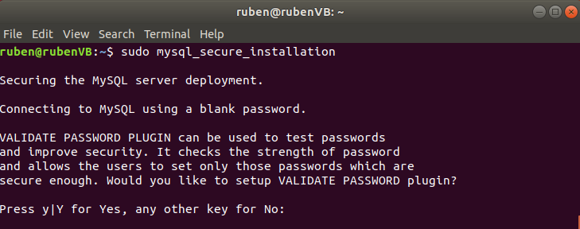
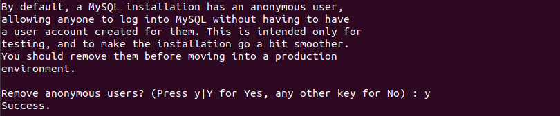
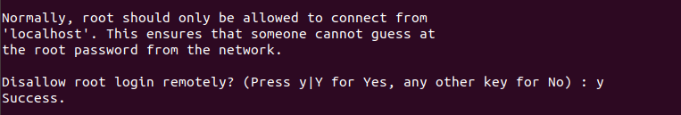
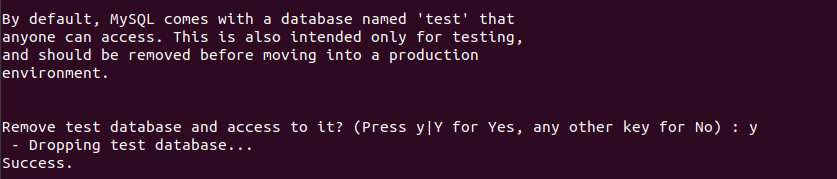
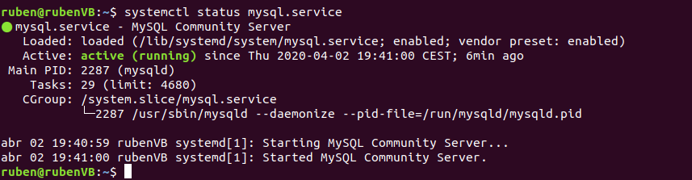
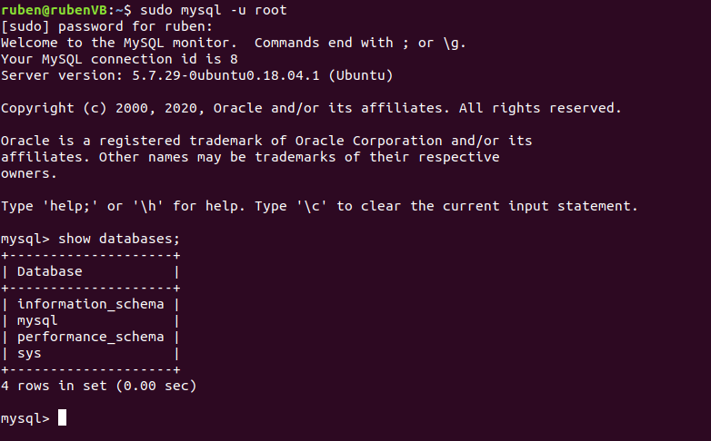

# Instalación de MySQL
MySQL es un gestor de bases de datos relacionales, y está considerado como uno de los gestores de código abierto más populares del mundo. Dispone de una licencia pública GPL y de una licencia comercial, de Oracle.

## Instalación en Ubuntu 18.04
### Índice
  - [Paso 1 - Instalar MySQL Server](#paso-1---instalar-mysql-server)
  - [Paso 2 - Configuración](#paso-2---configuraci%c3%b3n)
  - [Paso 3 - Login en la consola de MySQL](#paso-3---login-en-la-consola-de-mysql)

Antes de empezar la instalación es conveniente actualizar los repositorios y los paquetes con los siguientes comandos:
```
$ sudo apt-get update
```
```
$ sudo apt-get upgrade
```
### Paso 1 - Instalar MySQL Server
Para comenzar la instalación ejecutamos el siguiente comando:
```
$ sudo apt-get install mysql-server
```
El terminal informará de que hay que hacer una descarga y pedirá una confirmación. Una vez aceptado, comenzará la descarga y se instalarán los archivos necesarios.

[Volver al índice](#%c3%8dndice)
### Paso 2 - Configuración
La descarga de mysql-server trae un script para realizar una configuración segura, que se ejecuta con este comando:
```
$ sudo mysql_secure_installation
```
Por el terminal se harán una serie de preguntas para realizar la configuración:
* Primero se preguntará al usuario si quiere instalar un plugin que validará las contraseñas que se usen en el servidor. Escribe "y" o "Y" y pulsa enter para que se instale el plugin, escribe cualquier otra letra y pulsa enter para que **no** se instale:

  

* Al pulsar enter se te pedirá la contraseña del usuario "root" del servidor MySQL. Escribela, pulsa enter y vuelve a escribir y pulsar enter para confirmar la contraseña. Este usuario tendrá todos los permisos sobre el servidor.
* Después se preguntará si se desean eliminar los usuarios anónimos que se crean para poder acceder facilmente al servidor para realizar pruebas y configuraciones iniciales. Escribe "y" o "Y" para eliminarlos, cualquier otra letra para **no** eliminarlos:

  
* Se preguntará si se quiere bloquear el inicio de sesión remoto con el usuario "root". Ya que este usuario tiene todos los permisos sobre el servidor, es mejor contestar que si:

  
* MySQL server trae por defecto una base de datos "test" a la que cualquier usuario puede acceder. Escribe "y" o "Y" para eliminarla, cualquier otra letra para **no** eliminarla:

  
* Por último, se pregunta si se quieren actualizar los privilegios sobre las tablas ahora mismo. Lo habitual es responder que si:

  

[Volver al índice](#%c3%8dndice)
### Paso 3 - Login en la consola de MySQL
Antes de conectarnos a MySQL debemos comprobar que el servidor esté ejecutandose con el siguiente comando:
```
$ sudo systemctl status mysql.service
```
La ejecución del comando debería devolver lo siguiente:



Si el servidor no está activo, ejecutamos el siguiente comando para iniciarlo:
```
$ sudo systemctl start mysql.
```
Usamos este comando para iniciar sesión como "root" en MySQL:
```
$ sudo mysql -u root
```
Si todo ha ido bien, estaremos logeados y podremos empezar a ejecutar comandos de SQL:



[Volver al índice](#%c3%8dndice)