## Índice
 - [Creación de la base de datos "naves-espaciais"](#creaci%c3%b3n-de-la-base-de-datos-%22naves-espaciais%22)
    - [Inicio de sesión y creación del schema](#inicio-de-sesi%c3%b3n-y-creaci%c3%b3n-del-schema)
    - [Tabla Servizo](#tabla-servizo)
    - [Tabla Dependencia](#tabla-dependencia)
    - [Tabla Camara](#tabla-camara)
    - [Tabla Tripulación](#tabla-tripulaci%c3%b3n)
    - [Tabla Planeta](#tabla-planeta)
    - [Tabla Visita](#tabla-visita)
    - [Tabla Habita](#tabla-habita)
    - [Tabla Raza](#tabla-raza)
    - [Claves foráneas Habita](#claves-for%c3%a1neas-habita)
    - [Comprobaciones Camara](#comprobaciones-camara)
 - [Creación de la base de datos "proxecto-investigación"](#creaci%c3%b3n-de-la-base-de-datos-%22proxecto-investigacion%22)
   - [Inicio de sesión y creación del schema](#inicio-de-sesi%c3%b3n-y-creaci%c3%b3n-del-schema)
   - [Tabla Sede](#tabla-sede)
   - [Tabla Departamento](#tabla-departamento)
   - [Tabla Ubicación](#tabla-ubicaci%c3%b3n)
   - [Tabla Grupo](#tabla-grupo)
   - [Tabla Profesor](#tabla-profesor)
   - [Tabla Proxecto](#tabla-proxecto)
   - [Claves foráneas Departamento](#claves-for%c3%a1neas-departamento)
   - [Claves foráneas Grupo](#claves-for%c3%a1neas-grupo)
   - [Tabla Participa](#tabla-participa)
   - [Tabla Programa](#tabla-programa)
   - [Tabla Financia](#tabla-financia)
   - [Claves foráneas Financia](#claves-for%c3%a1neas-financia)
   - [Correcciones](#correcciones)

# Creación de la base de datos "naves-espaciais"
En este apartado se explicará la creación de la BD "naves-espaciais" del esquema relacional explicado en [este ejercicio.](https://github.com/davidgchaves/first-steps-with-git-and-github-wirtz-asir1-and-dam1/tree/master/exercicios-ddl/2-naves-espaciais)

> Esta sección está documentada para los comandos SQL necesarios en una máquina con Ubuntu 18 con MySQL Server instalado en ella

### Inicio de sesión y creación del schema
Abrimos un nuevo terminal en Ubuntu e iniciamos sesión en el servidor MySQL:

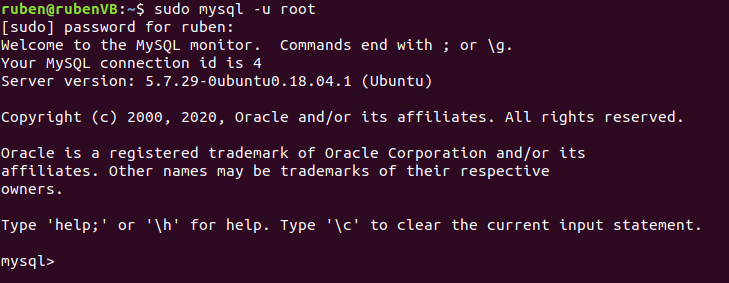

Usamos los siguientes comandos para crear el Schema y marcarlo como el schema activo:
```sql
CREATE SCHEMA naves_espaciais;
USE naves_espaciais;
```


[Volver al índice](#%c3%8dndice)
### Tabla Servizo
Este es el comando para crear la tabla:
```sql
CREATE TABLE servizo (
  clave_servizo CHAR(5),
  nome_servizo  VARCHAR(40),
  PRIMARY KEY (clave_servizo, nome_servizo)
);
```
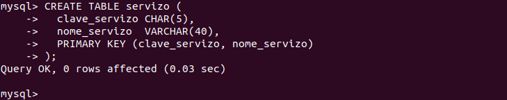

[Volver al índice](#%c3%8dndice)
### Tabla Dependencia
Este es el comando para crear la tabla:
```sql
CREATE TABLE dependencia (
  codigo_dependencia CHAR(5),
  nome_dependencia   VARCHAR(40) NOT NULL UNIQUE,
  funcion            VARCHAR(20),
  localizacion       VARCHAR(20),
  clave_servizo      CHAR(5) NOT NULL,
  nome_servizo       VARCHAR(40) NOT NULL,
  PRIMARY KEY (codigo_dependencia),
  FOREIGN KEY (clave_servizo, nome_servizo)
    REFERENCES servizo (clave_servizo, nome_servizo)
    ON DELETE CASCADE
    ON UPDATE CASCADE
);
```
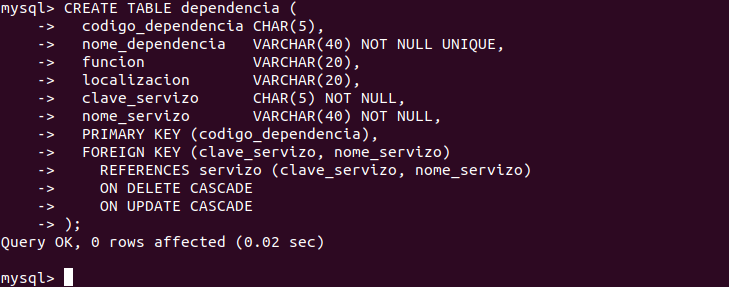

[Volver al índice](#%c3%8dndice)
### Tabla Camara
Este es el comando para crear la tabla:
```sql
CREATE TABLE camara (
  codigo_dependencia CHAR(5),
  categoria          VARCHAR(40) NOT NULL,
  capacidade         INTEGER     NOT NULL,
  PRIMARY KEY (codigo_dependencia),
  FOREIGN KEY (codigo_dependencia)
    REFERENCES dependencia (codigo_dependencia)
    ON DELETE CASCADE
    ON UPDATE CASCADE
);
```
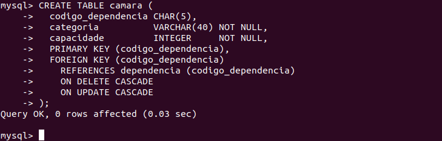

[Volver al índice](#%c3%8dndice)
### Tabla Tripulación
Este es el comando para crear la tabla:
```sql
CREATE TABLE tripulacion (
  codigo_tripulacion CHAR(5) PRIMARY KEY,
  nome_tripulacion   VARCHAR(40),
  categoria          CHAR(20)    NOT NULL,
  antigüidade        INTEGER     DEFAULT 0,
  procedencia        CHAR(20),
  adm                CHAR(20)    NOT NULL,
  codigo_dependencia CHAR(5) NOT NULL,
  codigo_camara      CHAR(5) NOT NULL,
  FOREIGN KEY (codigo_camara)
    REFERENCES camara (codigo_dependencia)
    ON UPDATE CASCADE
    ON DELETE CASCADE,
  FOREIGN KEY (codigo_dependencia)
    REFERENCES dependencia (codigo_dependencia)
    ON UPDATE CASCADE
    ON DELETE CASCADE
);
```
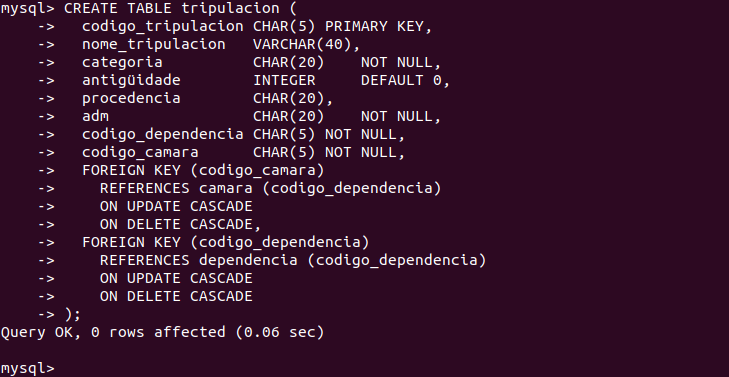

[Volver al índice](#%c3%8dndice)
### Tabla Planeta
Este es el comando para crear la tabla:
```sql
CREATE TABLE planeta (
  codigo_planeta CHAR(5)          PRIMARY KEY,
  nome_planeta   VARCHAR(40) NOT NULL UNIQUE,
  galaxia        VARCHAR(40) NOT NULL,
  coordenadas    CHAR(15)    NOT NULL UNIQUE
 );
```


[Volver al índice](#%c3%8dndice)
### Tabla Visita
Este es el comando para crear la tabla:
```sql
CREATE TABLE visita (
  codigo_tripulacion CHAR(5),
  codigo_planeta     CHAR(5),
  data_visita        DATE,
  tempo              INTEGER      NOT NULL,
  PRIMARY KEY (codigo_tripulacion, codigo_planeta, data_visita),
  FOREIGN KEY (codigo_tripulacion)
    REFERENCES tripulacion (codigo_tripulacion)
    ON UPDATE CASCADE
    ON DELETE CASCADE,
  FOREIGN KEY (codigo_planeta)
    REFERENCES planeta (codigo_planeta)
    ON UPDATE CASCADE
    ON DELETE CASCADE 
);
```
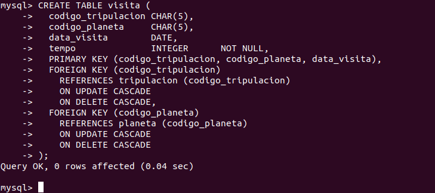

[Volver al índice](#%c3%8dndice)
### Tabla Habita
Este es el comando para crear la tabla:
```sql
CREATE TABLE habita (
  codigo_planeta    CHAR(5),
  nome_raza         VARCHAR(40),
  poboacion_parcial INTEGER     NOT NULL,
  PRIMARY KEY (codigo_planeta, nome_raza),
  FOREIGN KEY (codigo_planeta)
    REFERENCES planeta (codigo_planeta)
    ON UPDATE CASCADE
    ON DELETE CASCADE
);
```
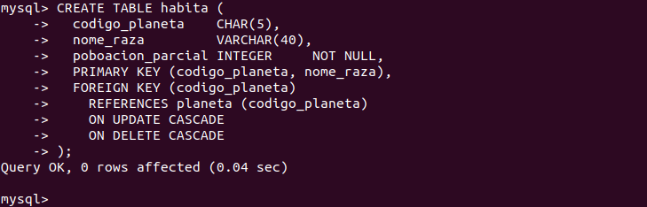

[Volver al índice](#%c3%8dndice)
### Tabla Raza
Este es el comando para crear la tabla:
```sql
CREATE TABLE raza (
  nome_raza       VARCHAR(40)  PRIMARY KEY,
  altura          INTEGER      NOT NULL,  -- cm
  anchura         INTEGER      NOT NULL,  -- cm
  peso            INTEGER      NOT NULL,  -- g
  poboacion_total INTEGER      NOT NULL
);
```
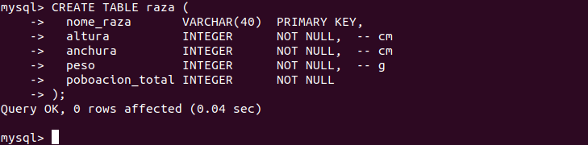

[Volver al índice](#%c3%8dndice)
### Claves foráneas Habita
Este es el comando para alterar la tabla y añadir las claves foráneas:
```sql
ALTER TABLE habita
  ADD FOREIGN KEY (nome_raza)
    REFERENCES raza (nome_raza)
    ON UPDATE CASCADE
    ON DELETE CASCADE;
```


[Volver al índice](#%c3%8dndice)
### Comprobaciones Camara
Este es el comando para añadir un `CHECK` a la tabla:
```sql
ALTER TABLE camara
  ADD CONSTRAINT capacidade_maior_de_cero
    CHECK (capacidade > 0);
```


[Volver al índice](#%c3%8dndice)

# Creación de la base de datos "proxecto-investigacion"
En este apartado se explicará la creación de la BD "proxecto-investigacion" del esquema relacional explicado en [este ejercicio.](https://github.com/davidgchaves/first-steps-with-git-and-github-wirtz-asir1-and-dam1/tree/master/exercicios-ddl/1-proxectos-de-investigacion)

> Esta sección está documentada para los comandos SQL necesarios en una máquina con Ubuntu 18 con MySQL Server instalado en ella

### Inicio de sesión y creación del schema
Abrimos un nuevo terminal en Ubuntu e iniciamos sesión en el servidor MySQL:


Usamos los siguientes comandos para crear el Schema y marcarlo como el schema activo:
```sql
CREATE SCHEMA proxecto_investigacion;
USE proxecto_investigacion;
```


[Volver al índice](#%c3%8dndice)
### Tabla Sede
Este es el comando para crear la tabla:
```sql
CREATE TABLE sede (
  nome_sede VARCHAR(30),
  campus    VARCHAR(30)  NOT NULL,
  PRIMARY KEY (nome_sede)
);
```


> En MySQL no podemos crear dominios personalizados

[Volver al índice](#%c3%8dndice)
### Tabla Departamento
Este es el comando para crear la tabla:
```sql
CREATE TABLE departamento (
  nome_departamento VARCHAR(30)  PRIMARY KEY,
  telefono          CHAR(9)      NOT NULL,
  director          CHAR(9)
);
```

> El atributo director no es marcado como clave foránea debido a que la tabla a la que referencia no existe todavía. Una vez la tabla esté creada se hará un `ALTER TABLE` para especificar que director es clave foránea

[Volver al índice](#%c3%8dndice)
### Tabla Ubicación
Este es el comando para crear la tabla:
```sql
CREATE TABLE ubicacion (
  nome_sede         VARCHAR(30),
  nome_departamento VARCHAR(30),
  PRIMARY KEY (nome_sede, nome_departamento),
  FOREIGN KEY (nome_sede)
    REFERENCES sede (nome_sede)
    ON DELETE CASCADE
    ON UPDATE CASCADE,
  FOREIGN KEY (nome_departamento)
    REFERENCES departamento (nome_departamento)
    ON DELETE CASCADE
    ON UPDATE CASCADE
);
```
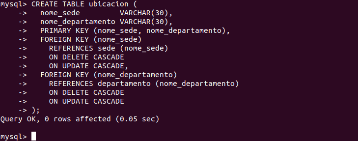

> **NOTA:** Cuando especificas a que tabla referencia la clave foránea tienes que indicar obligatoriamente a que atributos de la misma apunta, no como en PostgreSQL que si se omitian se referenciaba a la clave primaria

[Volver al índice](#%c3%8dndice)
### Tabla Grupo
Este es el comando para crear la tabla:
```sql
CREATE TABLE grupo (
  nome_grupo        VARCHAR(30),
  nome_departamento VARCHAR(30),
  area              VARCHAR(30) NOT NULL,
  lider             CHAR(9),
  FOREIGN KEY (nome_departamento) REFERENCES departamento (nome_departamento)
    ON DELETE CASCADE 
    ON UPDATE CASCADE,
  PRIMARY KEY (nome_grupo, nome_departamento)
);
```
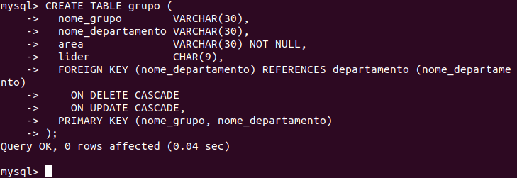

[Volver al índice](#%c3%8dndice)
### Tabla Profesor
Este es el comando para crear la tabla:
```sql
CREATE TABLE profesor (
  DNI            CHAR(9)    PRIMARY KEY,
  nome_profesor  VARCHAR(30) NOT NULL, 
  titulacion     VARCHAR(20) NOT NULL,
  experiencia    Integer,
  n_grupo        VARCHAR(30),
  n_departamento VARCHAR(30),
  FOREIGN KEY        (n_grupo,    n_departamento)
    REFERENCES grupo (nome_grupo, nome_departamento)
    ON DELETE SET NULL
    ON UPDATE CASCADE
);
```
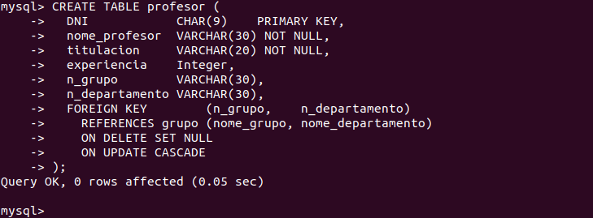

[Volver al índice](#%c3%8dndice)
### Tabla Proxecto
Este es el comando para crear la tabla:
```sql
CREATE TABLE proxecto (
  codigo_proxecto CHAR(5)  PRIMARY KEY,
  nome_proxecto   VARCHAR(30)  NOT NULL,
  Orzamento       FLOAT        NOT NULL,
  data_Inicio     DATE         NOT NULL,
  data_Fin        DATE,
  n_Gr            VARCHAR(30),
  n_Dep           VARCHAR(30),
  UNIQUE (nome_proxecto),
  CONSTRAINT Check_Dates
    CHECK (data_Inicio < data_Fin),
  CONSTRAINT FK_grupo_proxecto
    FOREIGN KEY (n_Gr, n_Dep)
    REFERENCES grupo (nome_grupo, nome_departamento)
    ON DELETE SET NULL
    ON UPDATE CASCADE
);
```
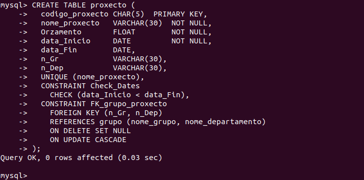

[Volver al índice](#%c3%8dndice)
### Claves foráneas Departamento
Este es el comando para alterar la tabla y añadir las claves foráneas:
```sql
ALTER TABLE departamento
  ADD FOREIGN KEY (director)
    REFERENCES profesor (DNI)
    ON DELETE SET NULL
    ON UPDATE CASCADE;
```


[Volver al índice](#%c3%8dndice)
### Claves foráneas Grupo
Este es el comando para alterar la tabla y añadir las claves foráneas:
```sql
ALTER TABLE grupo
  ADD FOREIGN KEY (lider)
    REFERENCES profesor (DNI)
    ON DELETE SET NULL
    ON UPDATE CASCADE;
```


[Volver al índice](#%c3%8dndice)
### Tabla Participa
Este es el comando para crear la tabla:
```sql
CREATE TABLE participa (
  DNI             CHAR(9),
  codigo_proxecto CHAR(5),
  data_Inicio     DATE        NOT NULL,
  data_Cese       DATE,
  dedicación      INTEGER     NOT NULL,
  PRIMARY KEY (DNI, codigo_proxecto),
  CHECK (data_Inicio < data_Cese),
  FOREIGN KEY (DNI)
    REFERENCES profesor (DNI)
    ON DELETE NO ACTION
    ON UPDATE CASCADE,
  FOREIGN KEY (codigo_proxecto)
    REFERENCES proxecto (codigo_proxecto)
    ON DELETE NO ACTION
    ON UPDATE CASCADE
);
```
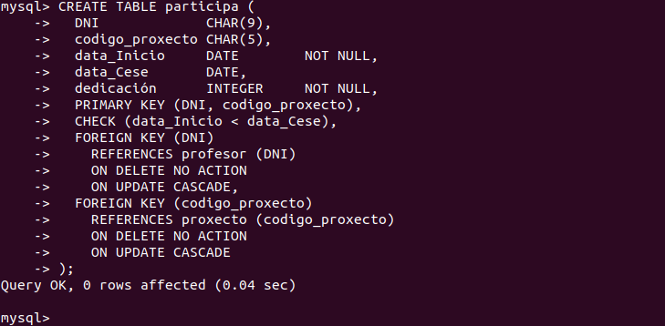

[Volver al índice](#%c3%8dndice)
### Tabla Programa
Este es el comando para crear la tabla:
```sql
CREATE TABLE programa (
  nome_Programa VARCHAR(30) PRIMARY KEY
); 
```


[Volver al índice](#%c3%8dndice)
### Tabla Financia
Este es el comando para crear la tabla:
```sql
CREATE TABLE financia (
  nome_Programa        VARCHAR(30),
  codigo_proxecto      CHAR(5),
  numero_Programa      CHAR(5) NOT NULL,
  cantidade_Financiada FLOAT       NOT NULL,
  PRIMARY KEY (nome_Programa, codigo_proxecto)
);
```


[Volver al índice](#%c3%8dndice)
### Claves foráneas Financia
Este es el comando para alterar la tabla y añadir las claves foráneas:
```sql
ALTER TABLE financia
  ADD FOREIGN KEY (codigo_proxecto)
    REFERENCES proxecto (codigo_proxecto)
    ON DELETE CASCADE
    ON UPDATE CASCADE;

ALTER TABLE financia
  ADD FOREIGN KEY (nome_Programa)
    REFERENCES programa (nome_Programa)
    ON DELETE CASCADE
    ON UPDATE CASCADE;
```
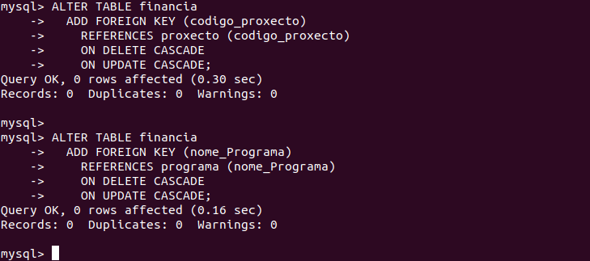

[Volver al índice](#%c3%8dndice)
### Correcciones
Al crear la tabla profesor se ha puesto mal el `ON UPDATE` y el `ON DELETE` de las claves foráneas. Para corregirlo tenemos que borrar la restricción de clave foránea y volver a añadirla con el `ALTER TABLE`:
```sql
ALTER TABLE profesor
  DROP FOREIGN KEY profesor_ibfk_1;

ALTER TABLE profesor
  ADD FOREIGN KEY    (n_grupo,    n_departamento)
    REFERENCES grupo (nome_grupo, nome_departamento)
    ON DELETE SET NULL
    ON UPDATE NO ACTION;
```
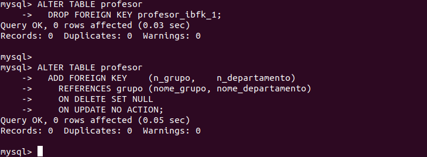

[Volver al índice](#%c3%8dndice)