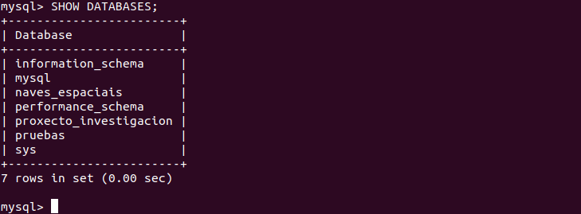
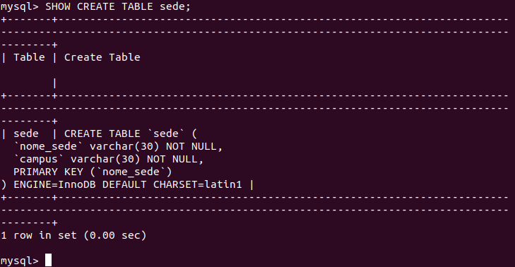
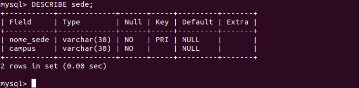

# Comandos para ver la estructura y los datos de una BD
## Ver los Schemas que hay en el servidor:
```sql
SHOW DATABASES;
```



## Ver las tablas que hay en el Schema activo:
```sql
SHOW TABLES;
```


## Ver las columnas y los detalles de una tabla:
```sql
(SHOW CREATE TABLE <nombre_tabla>; | DESCRIBE <nombre_tabla>;)
```



